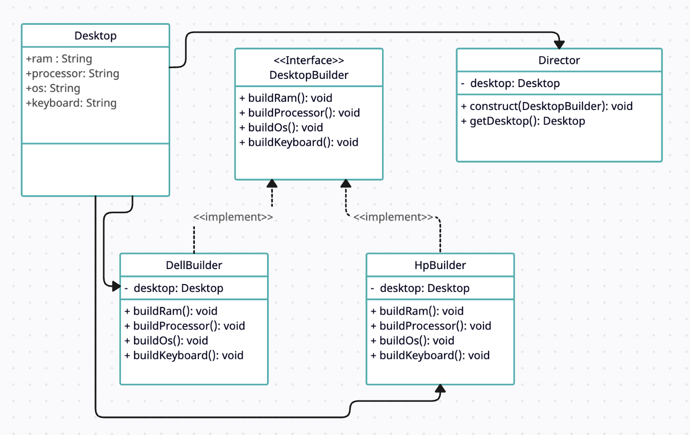

# Builder Design Pattern

## Overview

The Builder Design Pattern is a creational design pattern that separates the construction of a complex object from its representation. It provides a way to construct an object step by step while allowing different types of objects to be created with the same construction process. This pattern is particularly useful when an object has a large number of parameters, and you want to ensure the order and completeness of the object's construction.

## Use Case
The Builder pattern is ideal in the following situations:

- When an object needs to be constructed with various components or configurations.
- When you want to create complex objects with many optional parts.
- When you want to ensure that an object is only created when it is in a valid state.
- When you want to hide the construction details from the client code.
- When you need to support multiple representations of an object.

## Implementation

In this code example, we implement the Builder Design Pattern for creating desktop computers. We have the following key components:

- **Product (Desktop):** The final object we want to create, with various attributes such as RAM, processor, OS, and keyboard.

- **Builder:** An abstract class (or interface) that defines the steps needed to construct the product. Each concrete builder must implement these steps.

- **Concrete Builders (DellBuilder and HpBuilder):** These classes implement the builder interface and define how to build specific types of desktops with their respective attributes.

- **Director:** This class is responsible for coordinating the construction process using a specific builder. It abstracts the client code from the building process.

- **Client (main function):** The client code selects a builder based on user input (brand) and uses the director to construct the desktop. The finished product is displayed to the user.

## UML class diagram

## How to Use

1. Clone or download this repository.
2. Compile the code using a C++ compiler.
3. Run the executable.
4. Enter the brand of desktop you want to build (e.g., "Dell" or "Hp").
5. The program will use the appropriate builder to construct the desktop and display its attributes.

Feel free to explore and modify the code to better understand the Builder Design Pattern and its use in creating complex objects step by step.
